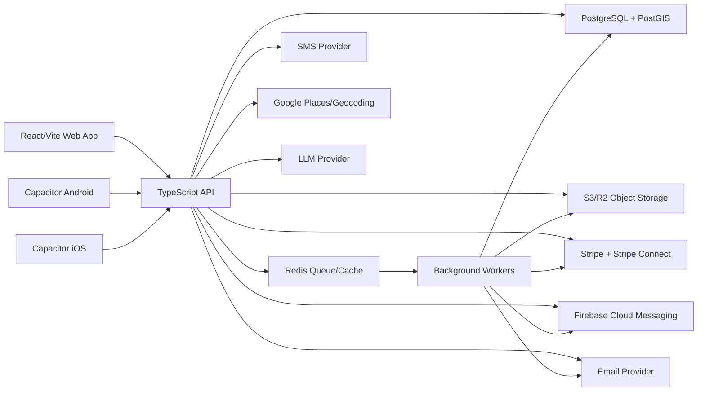

# Target Architecture Recommendation

## Recommended Shape

Use a modular monolith with clear domain modules, not microservices.

This product has several domains, but they share users, shops, orders, payments, notifications, and compliance data. Splitting into microservices now would add operational burden before the boundaries are proven. A modular monolith gives clean ownership while keeping deployment, transactions, and debugging simpler.

## High-Level Architecture

## Recommended Components

- Frontend: keep React/Vite initially and replace Base44 SDK usage behind an API adapter.
- Mobile: keep Capacitor initially to preserve working Android/iOS shells and reduce rebuild risk.
- Backend API: TypeScript modular monolith.
- Database: PostgreSQL with PostGIS for location search.
- ORM/migrations: Prisma or Drizzle. Prisma is recommended if the team wants mature migrations and onboarding simplicity.
- Background jobs: Redis + BullMQ, or managed queue equivalent.
- Object storage: S3-compatible storage with signed URLs.
- Auth: first-party auth using secure sessions/JWT access tokens; evaluate managed auth only if ownership tradeoffs are acceptable.
- Payments: Stripe Connect remains.
- Push: Firebase Cloud Messaging remains.
- Observability: structured logs, metrics, error tracking, audit logs.
- Deployment: containerized API and worker, managed PostgreSQL, managed Redis, static frontend hosting/CDN.

## Domain Modules

Backend modules should map to product boundaries:

- `auth`: sessions, login, OAuth/email/OTP if needed, current user.
- `users`: profiles, preferences, saved locations, referrals.
- `shops`: merchant shops, members, onboarding, verification.
- `listings`: surplus listing lifecycle, images, availability, AI assistance.
- `orders`: checkout, reservation, status transitions, pickup verification.
- `payments`: Stripe PaymentIntents, Connect accounts, subscriptions, webhook handling.
- `ledger`: retailer balances, fees, payouts, reconciliation.
- `compliance`: waste logs, compliance events, reports, corrections, donations, audit locks.
- `notifications`: in-app, push, email, reminders, preferences.
- `messaging`: conversations, messages, unread counts, reports.
- `loyalty`: programs, points, rewards, redemptions.
- `admin`: operational dashboards, review queues, platform analytics.
- `files`: upload policy, signed URLs, image/document metadata.
- `geo`: places, geocoding, nearby search.
- `ai`: prediction, listing enrichment, assistant features.

## Deployment Environments

Recommended environments:

- `local`: Docker Compose for Postgres, Redis, API, worker; frontend Vite dev server.
- `staging`: production-like data model, test Stripe mode, test Firebase project, real migrations.
- `production`: managed database, backups, observability, deployment approvals.

## Migration Strategy

Avoid a full rewrite cutover. Introduce a custom API and replace Base44 flow-by-flow:

1. Create API shell and database schema.
2. Build a frontend API adapter that can call either Base44 or custom API per module.
3. Migrate authentication and user profile foundation.
4. Migrate shops/listings/orders as the core transaction path.
5. Migrate payments/payouts/compliance/notifications.
6. Remove `@base44/sdk`, `@base44/vite-plugin`, and `base44/*` only after parity is proven.

## Why This Architecture Fits

- Preserves the working product while moving ownership away from Base44.
- Supports real transactions for inventory, orders, payments, and compliance.
- Keeps deployment understandable for a small team.
- Allows future extraction of heavy modules such as notifications or analytics only if scale justifies it.

